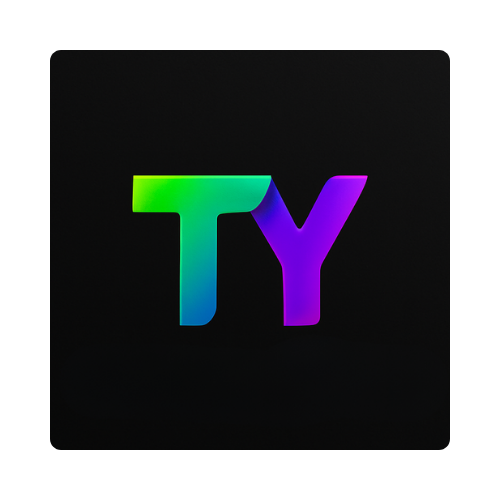
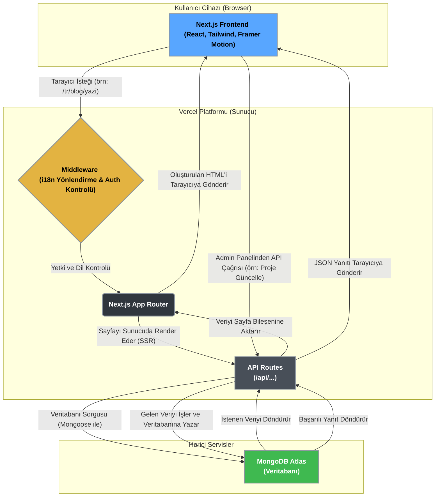

<div align="center">
  

  <h1 align="center">Talha Yüce - Gelişmiş Portfolyo ve İçerik Yönetim Platformu</h1>
  
  <p align="center">
    Next.js 14, TypeScript ve MongoDB üzerine inşa edilmiş, yüksek performanslı, tam donanımlı ve modern bir kişisel portfolyo ve blog platformu.
  </p>

  <p align="center">
    <a href="https://talha-yuce.site/" target="_blank">
      <strong>🚀 Live Demo »</strong>
    </a>
    &nbsp;&nbsp;&nbsp;|&nbsp;&nbsp;&nbsp;
    <a href="https://github.com/talhayuce/portfolio-website/issues" target="_blank">
      Rapor a Bug
    </a>
    &nbsp;&nbsp;&nbsp;|&nbsp;&nbsp;&nbsp;
    <a href="https://github.com/talhayuce/portfolio-website/pulls" target="_blank">
      Request a Feature
    </a>
  </p>
  <br/>
</div>

<!-- Badges -->
<div align="center">
  <a href="https://nextjs.org/"></a>
  <a href="https://react.dev/"></a>
  <a href="https://www.typescriptlang.org/"></a>
  <a href="https://tailwindcss.com/"></a>
  <a href="https://www.mongodb.com/"></a>
</div>

---

## 🎯 Proje Felsefesi ve Hedefler

Bu proje, standart bir portfolyo sitesinin sınırlarını aşarak, geliştiriciye tam kontrol sunan, ölçeklenebilir ve modern bir dijital kimlik platformu olmayı hedefler. Temel felsefesi üç ana sütun üzerine kuruludur:

1.  **Maksimum Performans**: Sunucu tarafı render (SSR), statik site oluşturma (SSG) ve en yeni Next.js özelliklerini kullanarak ışık hızında bir kullanıcı deneyimi sunmak. Core Web Vitals metriklerinde en yüksek skorları hedeflemek.
2.  **Üst Düzey Geliştirici Deneyimi (DX)**: TypeScript ile tip güvenliği, modüler ve anlaşılır bir dosya yapısı, yeniden kullanılabilir bileşenler ve kolay yapılandırma ile geliştirme sürecini keyifli hale getirmek.
3.  **Dinamik ve Esnek İçerik Yönetimi**: Koda dokunmadan, kullanıcı dostu bir admin paneli üzerinden tüm site içeriğini (projeler, blog yazıları, CV detayları) yönetme imkanı sunmak.

---

## ✨ Kapsamlı Özellikler

Bu platform, modern bir web uygulamasından beklenen tüm özellikleri ve daha fazlasını sunar:

### 👨‍💻 Frontend ve Kullanıcı Deneyimi

-   **Tamamen Duyarlı Tasarım**: Mobil, tablet ve masaüstü cihazlarda kusursuz bir görünüm.
-   **Modern UI/UX**: `shadcn/ui` ve `Tailwind CSS` ile oluşturulmuş estetik ve sezgisel arayüzler.
-   **Akıcı Animasyonlar**: `Framer Motion` ile pürüzsüz sayfa geçişleri ve mikro etkileşimler.
-   **Çoklu Dil Desteği (i18n)**: Türkçe ve İngilizce dilleri arasında URL tabanlı (`/tr`, `/en`) geçiş. Dil dosyaları `lib/i18n/dictionaries` altında JSON formatında yönetilir.
-   **Karanlık ve Aydınlık Mod**: Kullanıcının sistem tercihine otomatik uyum sağlayan ve manuel olarak değiştirilebilen tema desteği.
-   **Dinamik İçerik Render**: Proje ve blog içerikleri, veritabanından gelen JSON yapısına göre dinamik olarak `ProjectContentRenderer` ve `BlogContentRenderer` bileşenleri ile oluşturulur.
-   **Bileşen Kütüphanesi**: `components/` dizini altında yapılandırılmış, yeniden kullanılabilir 50'den fazla React bileşeni.

### ⚙️ Backend ve Veritabanı

-   **Güçlü API Katmanı**: `app/api` altında yapılandırılmış, RESTful prensiplerine uygun, korumalı ve halka açık API endpoint'leri.
-   **MongoDB Entegrasyonu**: Tüm dinamik veriler (kullanıcılar, profiller, projeler, blog yazıları) MongoDB Atlas üzerinde güvenle saklanır.
-   **Mongoose ORM**: `lib/models` altında tanımlanmış katı şemalar (Schemas) ile veri bütünlüğü ve tutarlılığı sağlanır.
-   **Servis Katmanı Mimarisi**: `lib/services` altında veritabanı işlemlerini soyutlayan servisler (ör: `projectService.ts`) bulunur. Bu, kod tekrarını önler ve bakımı kolaylaştırır.
-   **Güvenli Kimlik Doğrulama**: JWT (JSON Web Tokens) tabanlı oturum yönetimi. Admin şifresi `bcrypt` ile hash'lenerek veritabanında saklanır.

### 🔐 Admin Paneli

-   **Kapsamlı Yönetim Arayüzü**: `/admin` yolu altında yer alan, sitenin tüm dinamik yönlerini yönetmek için tasarlanmış özel bir SPA (Single Page Application).
-   **Güvenlik**: Admin paneline erişim, `middleware.ts` dosyasında JWT kontrolü ile sağlanır. Yetkisiz erişimler giriş sayfasına yönlendirilir.
-   **Dashboard**: Site istatistikleri (içerik sayıları vb.) ve son aktivitelere genel bir bakış sunar.
-   **İçerik Editörleri**: Hem projeler hem de blog yazıları için zengin metin editörü benzeri arayüzler. İçerik bölümleri (paragraf, başlık, kod bloğu, resim, alıntı) dinamik olarak eklenebilir ve sıralanabilir.
-   **Otomatik Veri Yenileme**: `useAdminRefresh` adlı özel bir hook sayesinde, panelde yapılan bir değişiklik (silme, yayınlama, güncelleme) sonrası veriler otomatik olarak yeniden çekilir. Bu, sayfayı manuel yenileme ihtiyacını ortadan kaldırır.

### 🚀 SEO ve Performans

-   **Dinamik Meta Etiketleri**: Her sayfa için özel `title`, `description` ve diğer meta etiketleri sunucu tarafında oluşturulur.
-   **Dinamik OG Image**: Paylaşılan linklerin sosyal medyada zengin bir önizleme sunması için `/api/og-image` endpoint'i, her blog ve proje için anında özel bir "Open Graph" görseli üretir.
-   **Otomatik `sitemap.ts` ve `robots.ts`**: Veritabanındaki tüm dinamik sayfaları (blog, projeler) içeren bir site haritası ve arama motoru kuralları otomatik olarak oluşturulur ve güncellenir.
-   **Vercel Optimizasyonları**: Proje, Vercel'in sunduğu "Edge Network", "Image Optimization" ve "Analytics & Speed Insights" gibi özelliklerden tam olarak faydalanır.

---

## 🏗️ Sistem Mimarisi

Aşağıdaki diyagram, uygulamanın temel mimarisini ve veri akışını göstermektedir:



---

## 🛠️ Teknoloji Derinliği

| Kategori              | Teknoloji                                                                                                      | Neden Seçildi?                                                                                                                              |
| --------------------- | -------------------------------------------------------------------------------------------------------------- | ------------------------------------------------------------------------------------------------------------------------------------------- |
| **Framework**         | [Next.js 14](https://nextjs.org/)                                                                              | SSR, SSG, App Router ve API rotaları gibi özellikleri bir arada sunarak hem performanslı hem de tam donanımlı uygulamalar için en iyi seçim. |
| **Backend**           | [Next.js API Routes](https://nextjs.org/docs/app/building-your-application/routing/route-handlers)               | Ayrı bir backend sunucusuna ihtiyaç duymadan, aynı projede monorepo benzeri bir yapıda güçlü API'ler oluşturma imkanı sunar.                 |
| **Veritabanı**        | [MongoDB Atlas](https://www.mongodb.com/cloud/atlas) & [Mongoose](https://mongoosejs.com/)                       | Esnek şema yapısı, JSON benzeri dokümanlar ve ölçeklenebilirlik, içerik odaklı bu proje için idealdir. Mongoose ise geliştirme sürecini hızlandırır. |
| **UI Kütüphanesi**      | [React](https://react.dev/) & [shadcn/ui](https://ui.shadcn.com/)                                              | React'in bileşen tabanlı mimarisi ve shadcn/ui'nin özelleştirilebilir, erişilebilir bileşenleri modern ve bakımı kolay arayüzler sağlar.    |
| **Styling**           | [Tailwind CSS](https://tailwindcss.com/)                                                                       | Hızlı prototipleme, tutarlı bir tasarım dili ve gereksiz CSS'i ortadan kaldıran "utility-first" yaklaşımı için tercih edildi.               |
| **Animasyon**         | [Framer Motion](https://www.framer.com/motion/)                                                                | React için güçlü ve kullanımı kolay bir animasyon kütüphanesi olması, karmaşık ve akıcı animasyonları basit bir şekilde yapmayı sağlar.        |
| **Deployment**        | [Vercel](https://vercel.com/)                                                                                    | Next.js'in yaratıcıları tarafından geliştirilen, CI/CD süreçlerini otomatikleştiren ve global Edge Network ile en iyi performansı sunan platform. |

---

## 📂 Proje Yapısı ve Açıklamaları

Proje, modüler ve ölçeklenebilir bir yapıya sahiptir. Ana dizinler ve sorumlulukları:

```
/
├── app/
│   ├── [locale]/           # Dil bazlı route'lar (tr, en). Layout ve sayfalar burada.
│   │   ├── admin/          # Korumalı admin paneli sayfaları.
│   │   ├── blog/           # Halka açık blog listesi ve detay sayfaları.
│   │   ├── projects/       # Halka açık proje listesi ve detay sayfaları.
│   │   └── ...             # Anasayfa, Hakkımda, İletişim gibi statik sayfalar.
│   ├── api/                # Tüm backend API endpoint'leri burada yaşar.
│   │   ├── admin/          # Sadece yetkili adminin erişebileceği API'ler.
│   │   └── ...             # Blog, projeler gibi halka açık verileri sunan API'ler.
│   └── layout.tsx          # Kök layout. Dil ve tema sağlayıcıları burada yapılandırılır.
├── components/             # Uygulama genelinde kullanılan paylaşılan React bileşenleri.
│   ├── ui/                 # shadcn/ui tarafından yönetilen temel UI bileşenleri.
│   └── ...                 # BlogCard, ProjectCard gibi özel ve karmaşık bileşenler.
├── config/                 # Site genelindeki sabit yapılandırmalar (örn: site.ts).
├── hooks/                  # Yeniden kullanılabilir özel React hook'ları (örn: useAdminRefresh).
├── lib/                    # Projenin beyni: Yardımcı fonksiyonlar, servisler ve ayarlar.
│   ├── i18n/               # Uluslararasılaştırma (i18n) mantığı ve dil dosyaları.
│   ├── middleware/         # Özel middleware mantığı (örn: admin-auth.ts).
│   ├── models/             # MongoDB için Mongoose şema tanımları (BlogPost.ts, Project.ts).
│   ├── services/           # Veritabanı işlemlerini soyutlayan iş mantığı katmanı.
│   └── utils.ts            # Genel yardımcı fonksiyonlar.
├── public/                 # Statik varlıklar (resimler, fontlar, favicon).
├── middleware.ts           # Gelen isteklere ilk müdahale eden katman. URL yönlendirme ve yetki kontrolü.
└── next.config.mjs         # Next.js'in temel yapılandırma dosyası.
```

---

## ⚙️ Kurulum ve Başlatma

Projeyi yerel makinenizde çalıştırmak için aşağıdaki adımları izleyin:

**1. Ortam Değişkenleri:**
   Proje kök dizininde `.env.local` adında bir dosya oluşturun. `.env.example` dosyasını kopyalayarak başlayabilirsiniz.

   ```env
   # MongoDB Connection String
   MONGODB_URI="mongodb+srv://<user>:<password>@<cluster-url>/<database-name>?retryWrites=true&w=majority"

   # Admin User Credentials (change these!)
   ADMIN_EMAIL="admin@example.com"
   ADMIN_USERNAME="admin"
   ADMIN_PASSWORD="your_secure_password" # Bu şifre ilk admin oluşturmada kullanılacak.

   # JWT Configuration
   JWT_SECRET="your_super_secret_and_long_jwt_key_for_security"
   JWT_EXPIRES_IN="7d"
   
   # Public URL of your site
   NEXT_PUBLIC_SITE_URL="http://localhost:3000"
   ```
   > **Not**: `ADMIN_PASSWORD` production'da doğrudan kullanılmaz. Bir kerelik admin oluşturma script'i ile şifrenin hash'lenmiş hali veritabanına yazılmalıdır.

**2. Projeyi Klonlayın:**
   ```bash
   git clone https://github.com/talhayuce/portfolio-website.git
   cd portfolio-website
   ```

**3. Bağımlılıkları Yükleyin:**
   `pnpm` kullanılması tavsiye edilir.
   ```bash
   pnpm install
   ```

**4. Veritabanı Seed (Tohumlama):**
   İlk admin kullanıcısını oluşturmak için (isteğe bağlı):
   ```bash
   # Bu script'i oluşturabilir veya manuel olarak veritabanına ekleyebilirsiniz.
   # Örnek: /api/admin/seed endpoint'ine bir istek atarak.
   ```

**5. Geliştirme Sunucusunu Başlatın:**
   ```bash
   pnpm dev
   ```

**6. Uygulamayı Açın:**
   -   **Site:** [http://localhost:3000](http://localhost:3000)
   -   **Admin Paneli:** [http://localhost:3000/tr/admin](http://localhost:3000/tr/admin)

---

## 🗺️ Gelecek Planları ve Yol Haritası

Bu proje sürekli olarak geliştirilmektedir. Planlanan bazı özellikler:

-   [ ] **Gelişmiş Analitik Sayfası**: Admin panelinde sayfa görüntülenmeleri, referanslar ve kullanıcı davranışları hakkında daha detaylı grafikler.
-   [ ] **Yorum Sistemi**: Blog yazılarına Disqus veya özel bir çözüm ile yorum yapma özelliği.
-   [ ] **Daha Fazla Tema Seçeneği**: Kullanıcıların admin panelinden seçebileceği farklı renk paletleri.
-   [ ] **Test Kapsamının Artırılması**: Jest ve React Testing Library ile birim ve entegrasyon testlerinin eklenmesi.
-   [ ] **CI/CD İyileştirmeleri**: GitHub Actions ile testlerin ve linting kontrollerinin otomatikleştirilmesi.

---

## 🤝 Katkıda Bulunma

Projeye katkıda bulunmaktan mutluluk duyarım! Fikirlerinizi, hata raporlarınızı ve Pull Request'lerinizi bekliyorum.

1.  Bu repoyu fork'layın.
2.  Yeni bir özellik dalı oluşturun (`git checkout -b feature/YeniHarikaOzellik`).
3.  Değişikliklerinizi commit'leyin (`git commit -m 'feat: Yeni bir harika özellik eklendi'`).
4.  Dalınızı push'layın (`git push origin feature/YeniHarikaOzellik`).
5.  Bir Pull Request açarak değişikliklerinizi açıklayın.

## 📄 Lisans

Bu proje MIT Lisansı altında lisanslanmıştır. Detaylar için `LICENSE` dosyasına göz atabilirsiniz.

---

<div align="center">
  <p>Talha Yüce tarafından ❤️ ve klavye ile geliştirildi.</p>
</div>

